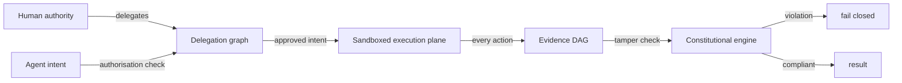

# CAUTEL — governed autonomy substrate

**Constitutionally governed execution plane with tamper-evident audit.**

CAUTEL is a governance-first execution environment for AI agents and
automation. Every action an agent takes must be authorised by a delegation
graph rooted in a human authority, executed inside a sandboxed boundary, and
recorded into a tamper-evident evidence chain. If the constitutional rules
are violated — or the system cannot prove they were satisfied — CAUTEL
**fails closed** and refuses to execute.

> This repository contains public documentation, formal specifications,
> governance rules, and black-box validation summaries. Runtime implementation
> remains proprietary; see [LICENSE](LICENSE) and
> [PUBLISH_CHECKLIST.md](PUBLISH_CHECKLIST.md).

## Why CAUTEL exists

Autonomous agents are powerful and fast — exactly the properties that make
them dangerous when ungoverned. CAUTEL separates three questions that most
agent stacks blur together:

1. **May this action happen?** (authority → delegation → intent)
2. **Did it happen inside the boundary?** (sandboxed execution plane)
3. **Can we prove what happened?** (tamper-evident evidence DAG)

## Repository map

| Folder | What it contains |
|---|---|
| [`docs/`](docs/) | High-level conceptual material — the front door |
| [`architecture/`](architecture/) | Conceptual system design, diagrams, lifecycles (no code) |
| [`specs/`](specs/) | Formal object specifications and governance invariants |
| [`governance/`](governance/) | Constitutional rules, enforcement semantics, fail-closed behaviour |
| [`validation/`](validation/) | Black-box validation methodology and result summaries |
| [`roadmap/`](roadmap/) | Forward direction and planned extensions |

## At a glance

## Status

- [x] Public documentation tree (this repository)
- [x] Formal specifications of the core objects
- [x] Governance rules and invariants
- [x] Black-box validation methodology
- [ ] Runtime release (proprietary)
- [ ] Federation model (see [roadmap](roadmap/))

## License

This repository and its documentation are proprietary (see [License](License)).
No runtime software is included.
