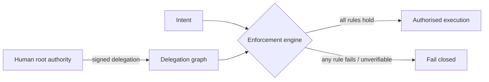

# Constitutional plane (conceptual)

The constitutional plane is the only component that decides **may this
happen**. It holds:

1. **The constitution** — the rule set (see
   [`governance/CONSTITUTION.md`](../governance/CONSTITUTION.md)).
2. **The delegation graph** — how authority flows from the human root.
3. **The enforcement engine** — the checker that evaluates every intent.

Key property: the enforcement engine has **no discretion**. It evaluates the
rules mechanically; anything it cannot verify is a refusal. See
[`governance/ENFORCEMENT_SEMANTICS.md`](../governance/ENFORCEMENT_SEMANTICS.md).
