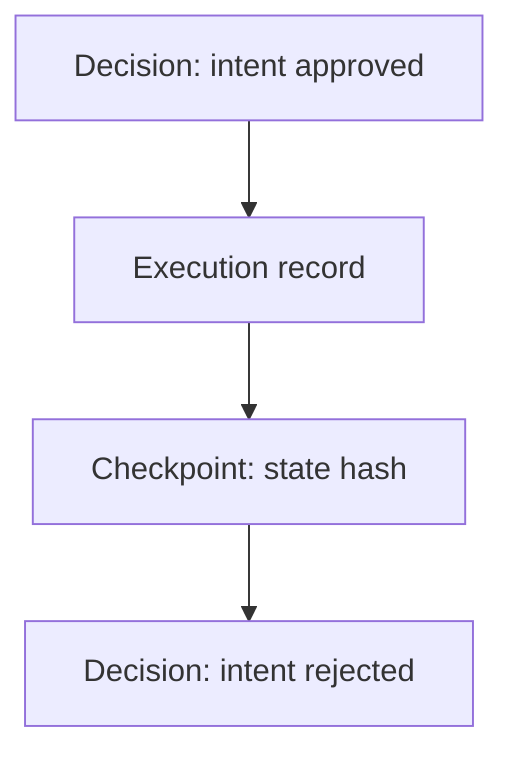
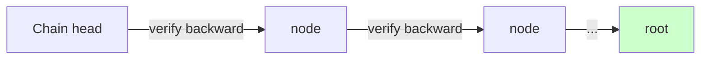

# Evidence plane (conceptual)

The evidence plane records everything the other planes decided and did, in
an append-only structure whose integrity can be checked at any time.

Properties:

- **Append-only** — records are never modified in place.
- **Tamper-evident** — every record commits to its predecessors; any
  modification, deletion or reordering breaks the chain and is detectable.
- **Replayable** — the full state history can be re-derived from the chain
  and compared (see [`specs/EVIDENCE_DAG.md`](../specs/EVIDENCE_DAG.md)).

A chain that fails backward verification ⇒ the system treats its evidence as
untrustworthy ⇒ enforcement fails closed.
