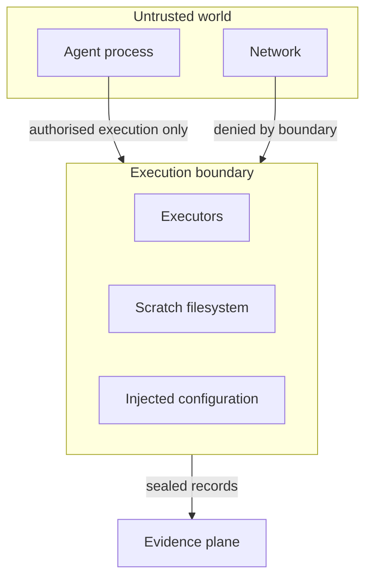

# Execution boundary (conceptual)

The execution plane is a **bounded region** in which authorised executions
run. The boundary is constructive: outside access is impossible by
construction, not prevented by policy.

Design rules:

1. Executors receive **only** the approved intent's arguments.
2. No ambient authority: no inherited keys, no ambient filesystem, no
   ambient network.
3. Everything the executor reads is injected explicitly by the boundary.
4. Every execution emits a sealed record to the evidence plane.
