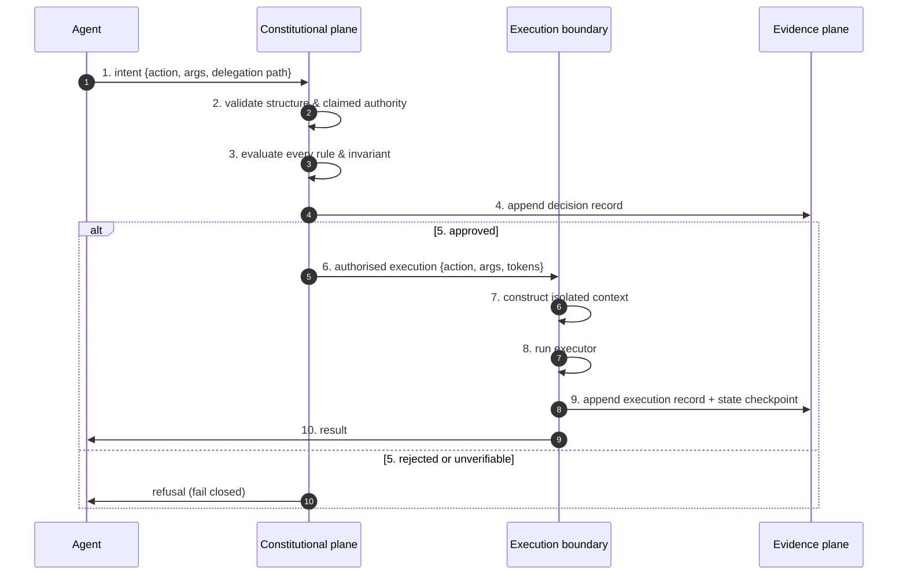

# Intent → execution → evidence lifecycle

```mermaid
sequenceDiagram
    autonumber
    participant A as Agent
    participant C as Constitutional plane
    participant X as Execution boundary
    participant E as Evidence plane

    A->>C: 1. intent {action, args, delegation path}
    C->>C: 2. validate structure & claimed authority
    C->>C: 3. evaluate every rule & invariant
    C->>E: 4. append decision record
    alt 5. approved
        C->>X: 6. authorised execution {action, args, tokens}
        X->>X: 7. construct isolated context
        X->>X: 8. run executor
        X->>E: 9. append execution record + state checkpoint
        X->>A: 10. result
    else 5. rejected or unverifiable
        C->>A: refusal (fail closed)
    end
```

Invariant (checked continuously): every execution record MUST have exactly
one approving decision record as its predecessor in the evidence DAG.
