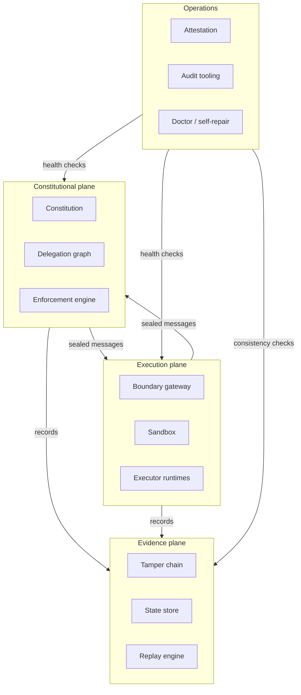

# Subsystems (conceptual)

```mermaid
flowchart TB
    subgraph CP[Constitutional plane]
        CN[Constitution]
        DG[Delegation graph]
        EE[Enforcement engine]
    end
    subgraph XP[Execution plane]
        GW[Boundary gateway]
        SB[Sandbox]
        RT[Executor runtimes]
    end
    subgraph EP[Evidence plane]
        CH[Tamper chain]
        ST[State store]
        RP[Replay engine]
    end
    subgraph OPS[Operations]
        AT[Attestation]
        AU[Audit tooling]
        DR[Doctor / self-repair]
    end
    XP -->|sealed messages| CP
    CP -->|sealed messages| XP
    CP & XP -->|records| EP
    OPS -->|health checks| CP
    OPS -->|health checks| XP
    OPS -->|consistency checks| EP
```

Each arrow is a **sealed, versioned message**. Subsystems never share
mutable state directly; they exchange verifiable records.
