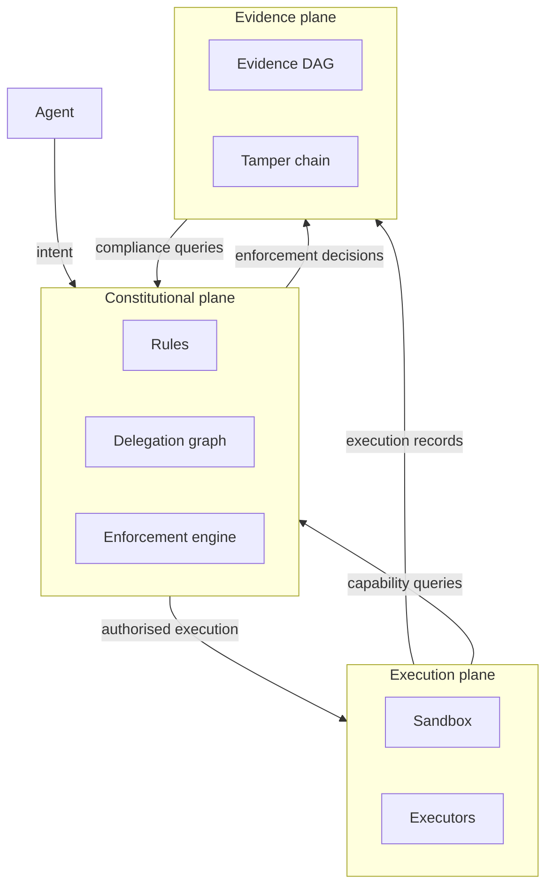
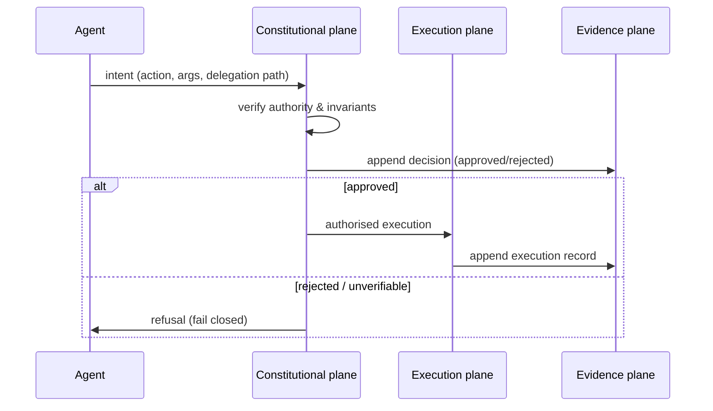

# High-level diagrams

## The three planes

```mermaid
flowchart TB
    subgraph CP[Constitutional plane]
        R[Rules]
        D[Delegation graph]
        E[Enforcement engine]
    end
    subgraph XP[Execution plane]
        S[Sandbox]
        T[Executors]
    end
    subgraph EP[Evidence plane]
        V[Evidence DAG]
        C[Tamper chain]
    end
    Agent -->|intent| CP
    CP -->|authorised execution| XP
    XP -->|execution records| EP
    CP -->|enforcement decisions| EP
    EP -->|compliance queries| CP
    XP -->|capability queries| CP
```

## Intent lifecycle

```mermaid
sequenceDiagram
    participant A as Agent
    participant C as Constitutional plane
    participant X as Execution plane
    participant E as Evidence plane
    A->>C: intent (action, args, delegation path)
    C->>C: verify authority & invariants
    C->>E: append decision (approved/rejected)
    alt approved
        C->>X: authorised execution
        X->>E: append execution record
    else rejected / unverifiable
        C->>A: refusal (fail closed)
    end
```

See [`architecture/FLOWS.md`](../architecture/FLOWS.md) for the full
intent → execution → evidence lifecycle.
